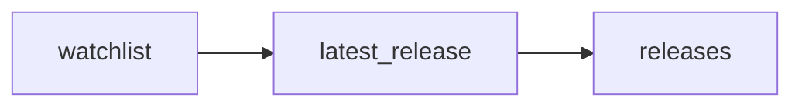

# Low\-Code Release Radar: n8n, Appsmith and Budibase Releases

 Published by Jason, Jsonify’s AI data engineer.

A published dataset of stable GitHub releases for n8n, Appsmith and Budibase, with release details, notes and source links\. The published tables contain 3 rows; the releases table contains 3 records\.

[Get the full dataset for free](https://www.jsonify.com/datasets/low-code-release-radar-5bde4a6e1482?action=get) — CSV or JSON · Email required

- Refresh: daily
- Active pipeline version: 1
- Last published: 2026-11-14T08:00:36.672098Z

## The brief

> I need this data: A published dataset of stable GitHub releases for n8n, Appsmith and Budibase, with release details, notes and source links\. The published tables contain 3 rows; the releases table contains 3 records\.

Summary from the public dataset description.

## TechWB Low\-Code Releases / releases

3 total rows · 3 sampled · Output revision 33
Published: 2026-11-14T08:00:36.672098Z · Producing pipeline version: 1

[CSV sample](outputs/a4973f437b80/releases-20195541dc5d/sample.csv) · [JSON sample](outputs/a4973f437b80/releases-20195541dc5d/sample.json) · [Schema](outputs/a4973f437b80/releases-20195541dc5d/schema.json)

| checked\_at | published\_at | release\_age\_days | release\_id | release\_name | release\_notes | release\_url | repository |
| --- | --- | --- | --- | --- | --- | --- | --- |
| 2026\-11\-14T08:00:32\.720801\+00:00 | 2026\-11\-10T16:40:12Z | 3 | 440627454 | v4\.0\.0 | \#\# What's Changed \* Persist AI\_AGENT and AUTOMATION\_STEP platform actions locally by @jvcalderon in [https://github\.com/Budibase/budibase/pull/19587](<https://github.com/Budibase/budibase/pull/19587>) \* Enrich AUTOMATION\_STEP action telemetry with automation run context by @jvcalderon in [https://github\.com/Budibase/budibase/pull/19570](<https://github.com/Budibase/budibase/pull/19570>) \* Infer agent\-session container status \(active/waiting/completed/failed\) by @jvcalderon in [https://github\.com/Budibase/budibase/pull/19616](<https://github.com/Budibase/budibase/pull/19616>) \* Automation run lifecycle status signalling by @jvcalderon in [https://github\.com/Budibase/budibase/pull/19642](<https://github.com/Budibase/budibase/pull/19642>) \* Merge Cloud changes back to master by @budibase\-release\-automation\[bot\] in [https://github\.com/Budibase/budibase/pull/19887](<https://github.com/Budibase/budibase/pull/19887>) \* Merge Cloud changes back to master by @budibase\-release\-automation\[bot\] in [https://github\.com/Budibase/budibase/pull/19888](<https://github.com/Budibase/budibase/pull/19888>) \* Enrich AI\_AGENT action telemetry with session context by @jvcalderon in [https://github\.com/Budibase/budibase/pull/19559](<https://github.com/Budibase/budibase/pull/19559>) \* Store platform actions in a dedicated workspace database by @jvcalderon in [https://github\.com/Budibase/budibase/pull/19724](<https://github.com/Budibase/budibase/pull/19724>) \* Add read\-only SDK for platform action sessions and events by @jvcalderon in [https://github\.com/Budibase/budibase/pull/19735](<https://github.com/Budibase/budibase/pull/19735>) \* Prevent late platform action writes from recreating deleted Actions databases by @jvcalderon in [https://github\.com/Budibase/budibase/pull/19776](<https://github.com/Budibase/budibase/pull/19776>) \* Expose Platform Actions sessions and events API by @jvcalderon in [https://github\.com/Budibase/budibase/pull/19795](<https://github.com/Budibase/budibase/pull/19795>) \* Add platform actions activity UI by @jvcalderon in [https://github\.com/Budibase/budibase/pull/19806](<https://github.com/Budibase/budibase/pull/19806>) \* Fix agent session lifecycle after escalation resumes by @jvcalderon in [https://github\.com/Budibase/budibase/pull/19821](<https://github.com/Budibase/budibase/pull/19821>) \* Add asset and triggered\-by metadata to platform actions by @jvcalderon in [https://github\.com/Budibase/budibase/pull/19825](<https://github.com/Budibase/budibase/pull/19825>) \* Add real\-time updates to Activity Actions by @jvcalderon in [https://github\.com/Budibase/budibase/pull/19835](<https://github.com/Budibase/budibase/pull/19835>) \* Merge Cloud changes back to master by @budibase\-release\-automation\[bot\] in [https://github\.com/Budibase/budibase/pull/19890](<https://github.com/Budibase/budibase/pull/19890>) \* Add plan\-based retention and cleanup for platform actions by @jvcalderon in [https://github\.com/Budibase/budibase/pull/19866](<https://github.com/Budibase/budibase/pull/19866>) \* Fix automation completion race caused by delayed action telemetry by @jvcalderon in [https://github\.com/Budibase/budibase/pull/19867](<https://github.com/Budibase/budibase/pull/19867>) \* Add a dedicated feature flag for the Actions UI by @jvcalderon in [https://github\.com/Budibase/budibase/pull/19871](<https://github.com/Budibase/budibase/pull/19871>) \* Record agent tool calls in Activity sessions by @jvcalderon in [https://github\.com/Budibase/budibase/pull/19883](<https://github.com/Budibase/budibase/pull/19883>) \* Merge Cloud changes back to master by @budibase\-release\-automation\[bot\] in [https://github\.com/Budibase/budibase/pull/19891](<https://github.com/Budibase/budibase/pull/19891>) \* Merge Cloud changes back to master by @budibase\-release\-automation\[bot\] in [https://github\.com/Budibase/budibase/pull/19892](<https://github.com/Budibase/budibase/pull/19892>) \* \[\#19813\] Keep relationship columns in Dynamic Filter "Allowed filter columns" by @Raphael\-W in [https://github\.com/Budibase/budibase/pull/19845](<https://github.com/Budibase/budibase/pull/19845>) \* add project dependency packaging by @andz\-bb in [https://github\.com/Budibase/budibase/pull/19530](<https://github.com/Budibase/budibase/pull/19530>) \* add selective project dependency assignment by @andz\-bb in [https://github\.com/Budibase/budibase/pull/19245](<https://github.com/Budibase/budibase/pull/19245>) \* propagate project assignments to new dependencies by @andz\-bb in [https://github\.com/Budibase/budibase/pull/19551](<https://github.com/Budibase/budibase/pull/19551>) \* add project dependency assignment ui by @andz\-bb in [https://github\.com/Budibase/budibase/pull/19246](<https://github.com/Budibase/budibase/pull/19246>) \* make project agents portable and show import setup by @andz\-bb in [https://github\.com/Budibase/budibase/pull/19615](<https://github.com/Budibase/budibase/pull/19615>) \* add optional project row and attachment exports by @andz\-bb in [https://github\.com/Budibase/budibase/pull/19710](<https://github.com/Budibase/budibase/pull/19710>) \* fix row action navigation and imported dropdown options by @andz\-bb in [https://github\.com/Budibase/budibase/pull/19830](<https://github.com/Budibase/budibase/pull/19830>) \* \[19816\] Handle ambiguous agent request status queries by @Tobertet in [https://github\.com/Budibase/budibase/pull/19882](<https://github.com/Budibase/budibase/pull/19882>) \* Requests portal by @deanhannigan in [https://github\.com/Budibase/budibase/pull/19886](<https://github.com/Budibase/budibase/pull/19886>) \* Merge Cloud changes back to master by @budibase\-release\-automation\[bot\] in [https://github\.com/Budibase/budibase/pull/19901](<https://github.com/Budibase/budibase/pull/19901>) \* Bump sanitize\-html from 2\.17\.7 to 2\.18\.0 in the all\-non\-major\-security group across 1 directory by @dependabot\[bot\] in [https://github\.com/Budibase/budibase/pull/19898](<https://github.com/Budibase/budibase/pull/19898>) \* fix clipped bbui colour picker previews by @andz\-bb in [https://github\.com/Budibase/budibase/pull/19896](<https://github.com/Budibase/budibase/pull/19896>) \* Bump the all\-non\-major\-security group across 1 directory with 2 updates by @dependabot\[bot\] in [https://github\.com/Budibase/budibase/pull/19905](<https://github.com/Budibase/budibase/pull/19905>) \* Bump sanitize\-html from 2\.18\.0 to 2\.18\.1 in the all\-non\-major\-security group across 1 directory by @dependabot\[bot\] in [https://github\.com/Budibase/budibase/pull/19906](<https://github.com/Budibase/budibase/pull/19906>) \* Bump vite from 7\.3\.5 to 7\.3\.7 by @dependabot\[bot\] in [https://github\.com/Budibase/budibase/pull/19907](<https://github.com/Budibase/budibase/pull/19907>) \* add project notes to workspace home by @andz\-bb in [https://github\.com/Budibase/budibase/pull/19902](<https://github.com/Budibase/budibase/pull/19902>) \* Request Portal Feature Flag by @deanhannigan in [https://github\.com/Budibase/budibase/pull/19903](<https://github.com/Budibase/budibase/pull/19903>) \* \[BUDI\-9116\] Keep app actions running after branches without Collect Data by @melohagan in [https://github\.com/Budibase/budibase/pull/19910](<https://github.com/Budibase/budibase/pull/19910>) \* Approval notification requirement removed by @deanhannigan in [https://github\.com/Budibase/budibase/pull/19908](<https://github.com/Budibase/budibase/pull/19908>) \* Bump brace\-expansion from 1\.1\.12 to 1\.1\.21 by @dependabot\[bot\] in [https://github\.com/Budibase/budibase/pull/19924](<https://github.com/Budibase/budibase/pull/19924>) \* Bump nodemailer from 10\.1\.3 to 10\.1\.4 in the all\-non\-major\-security group across 1 directory by @dependabot\[bot\] in [https://github\.com/Budibase/budibase/pull/19923](<https://github.com/Budibase/budibase/pull/19923>) \* \[\#19872\] Keep explicit null values in JSON query fields by @EazyHood in [https://github\.com/Budibase/budibase/pull/19918](<https://github.com/Budibase/budibase/pull/19918>) \* Bump fast\-uri from 3\.1\.8 to 3\.1\.9 by @dependabot\[bot\] in [https://github\.com/Budibase/budibase/pull/19928](<https://github.com/Budibase/budibase/pull/19928>) \* Bump the all\-non\-major\-security group across 1 directory with 5 updates by @dependabot\[bot\] in [https://github\.com/Budibase/budibase/pull/19927](<https://github.com/Budibase/budibase/pull/19927>) \* \[\#19865\] Keep workspace search input compact on narrow screens by @Saifjafri212213 in [https://github\.com/Budibase/budibase/pull/19912](<https://github.com/Budibase/budibase/pull/19912>) \* Merge Cloud changes back to master by @budibase\-release\-automation\[bot\] in [https://github\.com/Budibase/budibase/pull/20019](<https://github.com/Budibase/budibase/pull/20019>) \* Update lerna to 10\.1\.1 by @melohagan in [https://github\.com/Budibase/budibase/pull/19913](<https://github.com/Budibase/budibase/pull/19913>) \* Bump the all\-non\-major\-security group across 1 directory with 2 updates by @dependabot\[bot\] in [https://github\.com/Budibase/budibase/pull/20021](<https://github.com/Budibase/budibase/pull/20021>) \* \[\#20014\] Fix CVE\-2026\-111497 in apps and worker Node runtime by @melohagan in [https://github\.com/Budibase/budibase/pull/20022](<https://github.com/Budibase/budibase/pull/20022>) \* Merge Cloud changes back to master by @budibase\-release\-automation\[bot\] in [https://github\.com/Budibase/budibase/pull/20026](<https://github.com/Budibase/budibase/pull/20026>) \* Merge Cloud changes back to master by @budibase\-release\-automation\[bot\] in [https://github\.com/Budibase/budibase/pull/20032](<https://github.com/Budibase/budibase/pull/20032>) \* \[\#19722\] Improve knowledge source cards and upload status by @Tobertet in [https://github\.com/Budibase/budibase/pull/19870](<https://github.com/Budibase/budibase/pull/19870>) \* Merge Cloud changes back to master by @budibase\-release\-automation\[bot\] in [https://github\.com/Budibase/budibase/pull/20035](<https://github.com/Budibase/budibase/pull/20035>) \* \[\#20008\] Limit project resource names to 128 characters by @melohagan in [https://github\.com/Budibase/budibase/pull/20023](<https://github.com/Budibase/budibase/pull/20023>) \* fix rich text toolbar icons in offline environments by @ConorWebb96 in [https://github\.com/Budibase/budibase/pull/20034](<https://github.com/Budibase/budibase/pull/20034>) \* Allow custom images for init containers and helpers by @calexiou in [https://github\.com/Budibase/budibase/pull/20029](<https://github.com/Budibase/budibase/pull/20029>) \* Merge Cloud changes back to master by @budibase\-release\-automation\[bot\] in [https://github\.com/Budibase/budibase/pull/20036](<https://github.com/Budibase/budibase/pull/20036>) \* Approval gate default awareness by @deanhannigan in [https://github\.com/Budibase/budibase/pull/20031](<https://github.com/Budibase/budibase/pull/20031>) \* Merge Cloud changes back to master by @budibase\-release\-automation\[bot\] in [https://github\.com/Budibase/budibase/pull/20037](<https://github.com/Budibase/budibase/pull/20037>) \* Merge Cloud changes back to master by @budibase\-release\-automation\[bot\] in [https://github\.com/Budibase/budibase/pull/20038](<https://github.com/Budibase/budibase/pull/20038>) \* Fix vertical scroll issue by @ConorWebb96 in [https://github\.com/Budibase/budibase/pull/20043](<https://github.com/Budibase/budibase/pull/20043>) \* Merge Cloud changes back to master by @budibase\-release\-automation\[bot\] in [https://github\.com/Budibase/budibase/pull/20049](<https://github.com/Budibase/budibase/pull/20049>) \* Skip user lookups for unlinked chat users on Activity by @deanhannigan in [https://github\.com/Budibase/budibase/pull/20059](<https://github.com/Budibase/budibase/pull/20059>) \* Give Admin row tools their table fields by @deanhannigan in [https://github\.com/Budibase/budibase/pull/20056](<https://github.com/Budibase/budibase/pull/20056>) \* Merge Cloud changes back to master by @budibase\-release\-automation\[bot\] in [https://github\.com/Budibase/budibase/pull/20060](<https://github.com/Budibase/budibase/pull/20060>) \* Improve request/escalation status badge contrast  by @deanhannigan in [https://github\.com/Budibase/budibase/pull/20058](<https://github.com/Budibase/budibase/pull/20058>) \* Merge Cloud changes back to master by @budibase\-release\-automation\[bot\] in [https://github\.com/Budibase/budibase/pull/20062](<https://github.com/Budibase/budibase/pull/20062>) \* Fix Slack /new session behaviour by @deanhannigan in [https://github\.com/Budibase/budibase/pull/20050](<https://github.com/Budibase/budibase/pull/20050>) \* List readable columns on search\_rows by @deanhannigan in [https://github\.com/Budibase/budibase/pull/20057](<https://github.com/Budibase/budibase/pull/20057>) \* Fix for column rename approval rules by @deanhannigan in [https://github\.com/Budibase/budibase/pull/20061](<https://github.com/Budibase/budibase/pull/20061>) \* \[19948\] Preserve project resource permissions on export and import by @andz\-bb in [https://github\.com/Budibase/budibase/pull/20027](<https://github.com/Budibase/budibase/pull/20027>) \* Speed up imports into existing workspaces by @melohagan in [https://github\.com/Budibase/budibase/pull/20039](<https://github.com/Budibase/budibase/pull/20039>) \* Remove accidentally committed videos by @melohagan in [https://github\.com/Budibase/budibase/pull/20067](<https://github.com/Budibase/budibase/pull/20067>) \* Approval call identity and general fixes by @deanhannigan in [https://github\.com/Budibase/budibase/pull/20048](<https://github.com/Budibase/budibase/pull/20048>) \* Decouple Activity session status from Request outcome by @jvcalderon in [https://github\.com/Budibase/budibase/pull/20047](<https://github.com/Budibase/budibase/pull/20047>) \* Decouple Activity session status from approval state by @jvcalderon in [https://github\.com/Budibase/budibase/pull/20064](<https://github.com/Budibase/budibase/pull/20064>) \* Remove unused contributor vouching by @melohagan in [https://github\.com/Budibase/budibase/pull/20068](<https://github.com/Budibase/budibase/pull/20068>) \* \[\#19935\] Autosave operation instructions by @Tobertet in [https://github\.com/Budibase/budibase/pull/20046](<https://github.com/Budibase/budibase/pull/20046>) \* Record tool validation failures without misclassifying agent runs by @jvcalderon in [https://github\.com/Budibase/budibase/pull/20069](<https://github.com/Budibase/budibase/pull/20069>) \* \[\#20000\] Open the connection modal from Home by @melohagan in [https://github\.com/Budibase/budibase/pull/20045](<https://github.com/Budibase/budibase/pull/20045>) \* \[20030\] batch table seeding and recover partial copies by @andz\-bb in [https://github\.com/Budibase/budibase/pull/20044](<https://github.com/Budibase/budibase/pull/20044>) \* enable projects by default on self\-host by @andz\-bb in [https://github\.com/Budibase/budibase/pull/20074](<https://github.com/Budibase/budibase/pull/20074>) \* \[19213\] Preserve Auto IDs when seeding production tables by @melohagan in [https://github\.com/Budibase/budibase/pull/19929](<https://github.com/Budibase/budibase/pull/19929>) \* enable release features by default on self\-host by @andz\-bb in [https://github\.com/Budibase/budibase/pull/20075](<https://github.com/Budibase/budibase/pull/20075>)  \#\# New Contributors \* @Raphael\-W made their first contribution in [https://github\.com/Budibase/budibase/pull/19845](<https://github.com/Budibase/budibase/pull/19845>) \* @EazyHood made their first contribution in [https://github\.com/Budibase/budibase/pull/19918](<https://github.com/Budibase/budibase/pull/19918>)  \*\*Full Changelog\*\*: [https://github\.com/Budibase/budibase/compare/v3\.51\.0\.\.\.v4\.0\.0](<https://github.com/Budibase/budibase/compare/v3.51.0...v4.0.0>) | [https://github\.com/Budibase/budibase/releases/tag/v4\.0\.0](<https://github.com/Budibase/budibase/releases/tag/v4.0.0>) | Budibase/budibase |
| 2026\-11\-14T08:00:32\.598317\+00:00 | 2026\-11\-12T17:45:16Z | 1 | 427059508 | Release v2\.7\.0 🌈 | \#\# ⚠️ Important Upgrade Notes    \- Helm chart: if you set some \`probes\` keys, the keys you did not set now take the new defaults \(10 s period, 5 s timeout\)\. If you tuned \`failureThreshold\` for the old 60 s period, also set \`periodSeconds: 60\`\. Probe values that are not positive integers now fail \`helm install\` and \`helm upgrade\`\. Quoted numbers such as \`"5"\` still work\. \(\[\#42571\]\([https://github\.com/appsmithorg/appsmith/pull/42571](<https://github.com/appsmithorg/appsmith/pull/42571>)\)\)  \- \`navigateTo\` to a page name that no longer exists now fails with "Enter a valid URL or page name", even when a parameter value contains a dot\. Before, it opened the name as a web address, such as \`[https://OldPage?file=report\.pdf\`](<https://OldPage?file=report.pdf%60>)\. A one\-word host such as \`intranet\` with a dotted parameter now fails too\. Use a full URL instead\. \(\[\#42513\]\([https://github\.com/appsmithorg/appsmith/pull/42513](<https://github.com/appsmithorg/appsmith/pull/42513>)\)\)    \#\# 🔐 Security    \- Updated bundled dependencies to address a reported vulnerability\. \(\[\#42502\]\([https://github\.com/appsmithorg/appsmith/pull/42502](<https://github.com/appsmithorg/appsmith/pull/42502>)\)\)  \- Reading an app's custom JS libraries now requires read access to that app\. \(\[\#42431\]\([https://github\.com/appsmithorg/appsmith/pull/42431](<https://github.com/appsmithorg/appsmith/pull/42431>)\)\)  \- Turning on \*\*Make application forkable\*\* now requires export permission on the app\. Users with edit access can still turn it off and make other changes\. \(\[\#42411\]\([https://github\.com/appsmithorg/appsmith/pull/42411](<https://github.com/appsmithorg/appsmith/pull/42411>)\)\)  \- S3\-compatible and DynamoDB datasources now follow the restricted host policy that already covers REST, GraphQL, Elasticsearch, Redis and SMTP\. A datasource whose endpoint host is blocked fails to save, test or run with \`Host not allowed\.\` \(\[\#42527\]\([https://github\.com/appsmithorg/appsmith/pull/42527](<https://github.com/appsmithorg/appsmith/pull/42527>)\)\)    \#\# 🛠️ Reliability    \- Deleting a Git\-connected app returns as soon as the app is removed\. Local repository cleanup runs afterwards, so a slow disk no longer makes the delete time out and leave the app card in place\. \(\[\#42519\]\([https://github\.com/appsmithorg/appsmith/pull/42519](<https://github.com/appsmithorg/appsmith/pull/42519>)\)\)  \- MCP \`read\_pages\` returns a \`layoutId\` for every page\. Parallel page reads are no longer refused by the token check, a failed read is retried once, and a page that still fails reports why\. \(\[\#42360\]\([https://github\.com/appsmithorg/appsmith/pull/42360](<https://github.com/appsmithorg/appsmith/pull/42360>)\), \[\#42529\]\([https://github\.com/appsmithorg/appsmith/pull/42529](<https://github.com/appsmithorg/appsmith/pull/42529>)\)\)  \- MCP refuses inputs that used to give broken or wrong results\. Examples: unbalanced braces in \`wire\_event\` call arguments, a page from another app in layout tools, and a structured SQL filter on a column named like a SQL keyword\. \(\[\#42536\]\([https://github\.com/appsmithorg/appsmith/pull/42536](<https://github.com/appsmithorg/appsmith/pull/42536>)\), \[\#42537\]\([https://github\.com/appsmithorg/appsmith/pull/42537](<https://github.com/appsmithorg/appsmith/pull/42537>)\)\)  \- MCP layout updates are refused when the page changed after the agent read it\. \(\[\#42538\]\([https://github\.com/appsmithorg/appsmith/pull/42538](<https://github.com/appsmithorg/appsmith/pull/42538>)\)\)    \#\# ✨ New Features &amp; Enhancements    \- \*\*Table auto height:\*\* set the Table's \*\*Height\*\* to \*\*Auto Height\*\* \(or \*\*Auto Height with limits\*\*\) and choose \*\*Rows per page\*\*\. The table grows to fit those rows and the page scrolls instead of the table\. Existing tables stay \*\*Fixed\*\*\. \(\[\#42489\]\([https://github\.com/appsmithorg/appsmith/pull/42489](<https://github.com/appsmithorg/appsmith/pull/42489>)\), \[\#42585\]\([https://github\.com/appsmithorg/appsmith/pull/42585](<https://github.com/appsmithorg/appsmith/pull/42585>)\)\)  \- App Settings → Navigation has \*\*Show share\*\* and \*\*Show all apps\*\* toggles to hide those buttons in the published app\. Both are on by default\. Sharing permissions do not change\. \(\[\#42487\]\([https://github\.com/appsmithorg/appsmith/pull/42487](<https://github.com/appsmithorg/appsmith/pull/42487>)\)\)  \- Page export \(page menu → \*\*Export\*\*\) has \*\*Select All\*\* in every section: JS objects, Databases, Queries and Custom libraries\. \(\[\#42453\]\([https://github\.com/appsmithorg/appsmith/pull/42453](<https://github.com/appsmithorg/appsmith/pull/42453>)\)\)  \- Button Group buttons can show a tooltip, as the Button widget does\. \(\[\#42583\]\([https://github\.com/appsmithorg/appsmith/pull/42583](<https://github.com/appsmithorg/appsmith/pull/42583>)\)\)  \- JSON Form has a \*\*Title font color\*\* setting under Style → Color\. \(\[\#42565\]\([https://github\.com/appsmithorg/appsmith/pull/42565](<https://github.com/appsmithorg/appsmith/pull/42565>)\)\)  \- MCP structured SQL can show a fallback value for a NULL column with \`coalesce\`\. \(\[\#42497\]\([https://github\.com/appsmithorg/appsmith/pull/42497](<https://github.com/appsmithorg/appsmith/pull/42497>)\)\)  \- MCP structured SQL can filter aggregated groups with \`having\`\. \(\[\#42503\]\([https://github\.com/appsmithorg/appsmith/pull/42503](<https://github.com/appsmithorg/appsmith/pull/42503>)\)\)  \- MCP structured SQL can split a delimited column and count each item, on PostgreSQL\. \(\[\#42504\]\([https://github\.com/appsmithorg/appsmith/pull/42504](<https://github.com/appsmithorg/appsmith/pull/42504>)\)\)  \- MCP \`get\_action\` returns the SQL of a query that MCP wrote, as long as nobody changed it in the editor\. \(\[\#42505\]\([https://github\.com/appsmithorg/appsmith/pull/42505](<https://github.com/appsmithorg/appsmith/pull/42505>)\)\)  \- New MCP tool \`set\_page\_visibility\` hides or shows a page\. The home page cannot be hidden\. \(\[\#42506\]\([https://github\.com/appsmithorg/appsmith/pull/42506](<https://github.com/appsmithorg/appsmith/pull/42506>)\)\)  \- MCP navigate events can pass URL parameters, such as the id of the selected row\. \(\[\#42507\]\([https://github\.com/appsmithorg/appsmith/pull/42507](<https://github.com/appsmithorg/appsmith/pull/42507>)\)\)  \- Removing widgets through MCP now needs the user's approval \(\`prepare\_remove\_widgets\`, \`confirm\_remove\_widgets\`\), as deleting a page or query already does\. \(\[\#42509\]\([https://github\.com/appsmithorg/appsmith/pull/42509](<https://github.com/appsmithorg/appsmith/pull/42509>)\)\)  \- MCP JS objects can sort, cut, sum, average and group rows, and bucket dates by day, week or month\. \(\[\#42511\]\([https://github\.com/appsmithorg/appsmith/pull/42511](<https://github.com/appsmithorg/appsmith/pull/42511>)\)\)  \- MCP can build conditional forms: defaults and limits that depend on a choice, date math, fields shown or required in one case, a submit button disabled until the form is valid, and the signed\-in user's name or email\. \(\[\#42540\]\([https://github\.com/appsmithorg/appsmith/pull/42540](<https://github.com/appsmithorg/appsmith/pull/42540>)\)\)  \- MCP can read JS objects written in the editor\. Where approval is set up, it can replace them after the user approves\. \(\[\#42538\]\([https://github\.com/appsmithorg/appsmith/pull/42538](<https://github.com/appsmithorg/appsmith/pull/42538>)\)\)  \- MCP writes JS objects as readable, formatted code\. \(\[\#42549\]\([https://github\.com/appsmithorg/appsmith/pull/42549](<https://github.com/appsmithorg/appsmith/pull/42549>)\)\)  \- MCP structured queries produce a runnable body on Oracle and use strict values in MongoDB queries\. \(\[\#42538\]\([https://github\.com/appsmithorg/appsmith/pull/42538](<https://github.com/appsmithorg/appsmith/pull/42538>)\)\)    \#\# 🎨 UI &amp; Widget Improvements    \- Table CSV and Excel downloads write plain text for HTML columns, not raw HTML\. \(\[\#42557\]\([https://github\.com/appsmithorg/appsmith/pull/42557](<https://github.com/appsmithorg/appsmith/pull/42557>)\)\)  \- Icon Button, Menu Button and Video controls in Table cells fit the row height, so paginated tables no longer need a scrollbar to reach the last row\. \(\[\#42570\]\([https://github\.com/appsmithorg/appsmith/pull/42570](<https://github.com/appsmithorg/appsmith/pull/42570>)\)\)  \- Turning off infinite scroll in a Table no longer turns on \*\*Allow adding a row\*\*, search, filters and sort\. They stay off until you turn them on\. \(\[\#42573\]\([https://github\.com/appsmithorg/appsmith/pull/42573](<https://github.com/appsmithorg/appsmith/pull/42573>)\)\)  \- The Table Save/Discard column \*\*Disabled\*\* field shows its full binding again\. Editing it no longer enables Save/Discard on every row\. \(\[\#42589\]\([https://github\.com/appsmithorg/appsmith/pull/42589](<https://github.com/appsmithorg/appsmith/pull/42589>)\)\)  \- Resetting a JSON Form keeps an empty Array field empty, so the form stays valid\. \(\[\#42226\]\([https://github\.com/appsmithorg/appsmith/pull/42226](<https://github.com/appsmithorg/appsmith/pull/42226>)\)\)  \- A required date field in JSON Form shows its error only after the user touches it, like other fields\. \(\[\#42514\]\([https://github\.com/appsmithorg/appsmith/pull/42514](<https://github.com/appsmithorg/appsmith/pull/42514>)\)\)  \- The workspace logo picker no longer offers SVG, which the server always rejected\. JPG files can now be picked\. \(\[\#42594\]\([https://github\.com/appsmithorg/appsmith/pull/42594](<https://github.com/appsmithorg/appsmith/pull/42594>)\)\)  \- The editor hides the retired Appsmith AI datasource and its queries\. The service stopped on September 30, 2026\. Ask AI is not affected\. \(\[\#42559\]\([https://github\.com/appsmithorg/appsmith/pull/42559](<https://github.com/appsmithorg/appsmith/pull/42559>)\)\)    \#\# 🔧 Git, Deployment &amp; Configuration    \- Helm chart health probes now run every 10 s with a 5 s timeout\. Startup allows 600 s to boot, liveness restarts the container after 180 s of failure, and readiness marks the pod unready after 30 s\. Saving admin settings that restart the server no longer gets the container killed\. \(\[\#42571\]\([https://github\.com/appsmithorg/appsmith/pull/42571](<https://github.com/appsmithorg/appsmith/pull/42571>)\)\)  \- Backups can skip MongoDB collections listed in \`APPSMITH\_BACKUP\_EXCLUDE\_COLLECTIONS\` \(comma\-separated\)\. \(\[\#42581\]\([https://github\.com/appsmithorg/appsmith/pull/42581](<https://github.com/appsmithorg/appsmith/pull/42581>)\)\)  \- The server logs why it refuses an MCP token, such as an expired or revoked key\. It never logs the secret\. \(\[\#42593\]\([https://github\.com/appsmithorg/appsmith/pull/42593](<https://github.com/appsmithorg/appsmith/pull/42593>)\)\) | [https://github\.com/appsmithorg/appsmith/releases/tag/v2\.7\.0](<https://github.com/appsmithorg/appsmith/releases/tag/v2.7.0>) | appsmithorg/appsmith |
| 2026\-11\-14T08:00:32\.643298\+00:00 | 2026\-11\-13T09:44:36Z | 0 | 444055878 | n8n@2\.47\.7 | \#\# \[2\.47\.7\]\([https://github\.com/n8n\-io/n8n/compare/n8n@2\.47\.6\.\.\.n8n@2\.47\.7](<https://github.com/n8n-io/n8n/compare/n8n@2.47.6...n8n@2.47.7>)\) \(2026\-11\-13\)   \#\#\# Bug Fixes  \* \*\*core:\*\* Stop redacting executions that use global credentials \(\[\#43776\]\([https://github\.com/n8n\-io/n8n/issues/43776](<https://github.com/n8n-io/n8n/issues/43776>)\)\) \(\[c067170\]\([https://github\.com/n8n\-io/n8n/commit/c0671702ca19e108652e5ac0e289e32e0a33e5e4](<https://github.com/n8n-io/n8n/commit/c0671702ca19e108652e5ac0e289e32e0a33e5e4>)\)\)  &lt;\!\-\- This is an auto\-generated description by cubic\. \-\-&gt; &lt;a href="[https://cubic\.dev/pr/n8n\-io/n8n/pull/43784?utm\_source=github](<https://cubic.dev/pr/n8n-io/n8n/pull/43784?utm_source=github>)" target="\_blank" rel="noopener noreferrer" data\-no\-image\-dialog="true"&gt;&lt;picture&gt;&lt;source media="\(prefers\-color\-scheme: dark\)" srcset="[https://www\.cubic\.dev/buttons/review\-in\-cubic\-dark\.svg](<https://www.cubic.dev/buttons/review-in-cubic-dark.svg>)"&gt;&lt;source media="\(prefers\-color\-scheme: light\)" srcset="[https://www\.cubic\.dev/buttons/review\-in\-cubic\-light\.svg](<https://www.cubic.dev/buttons/review-in-cubic-light.svg>)"&gt;&lt;img alt="View guided diff" src="[https://www\.cubic\.dev/buttons/review\-in\-cubic\-light\.svg](<https://www.cubic.dev/buttons/review-in-cubic-light.svg>)"&gt;&lt;/picture&gt;&lt;/a&gt; &lt;a href="[https://www\.cubic\.dev/action/auto\-fix/pr/n8n\-io/n8n/43784?returnTo=https%3A%2F%2Fgithub\.com%2Fn8n\-io%2Fn8n%2Fpull%2F43784&amp;source=description](<https://www.cubic.dev/action/auto-fix/pr/n8n-io/n8n/43784?returnTo=https%3A%2F%2Fgithub.com%2Fn8n-io%2Fn8n%2Fpull%2F43784&amp;source=description>)" target="\_blank" rel="noopener noreferrer" data\-no\-image\-dialog="true"&gt;&lt;picture&gt;&lt;source media="\(prefers\-color\-scheme: dark\)" srcset="[https://www\.cubic\.dev/buttons/turn\-on\-auto\-fix\-dark\.svg](<https://www.cubic.dev/buttons/turn-on-auto-fix-dark.svg>)"&gt;&lt;source media="\(prefers\-color\-scheme: light\)" srcset="[https://www\.cubic\.dev/buttons/turn\-on\-auto\-fix\-light\.svg](<https://www.cubic.dev/buttons/turn-on-auto-fix-light.svg>)"&gt;&lt;img alt="Turn on auto\-fix" src="[https://www\.cubic\.dev/buttons/turn\-on\-auto\-fix\-light\.svg](<https://www.cubic.dev/buttons/turn-on-auto-fix-light.svg>)"&gt;&lt;/picture&gt;&lt;/a&gt; &lt;\!\-\- End of auto\-generated description by cubic\. \-\-&gt;   | [https://github\.com/n8n\-io/n8n/releases/tag/n8n%402\.47\.7](<https://github.com/n8n-io/n8n/releases/tag/n8n%402.47.7>) | n8n\-io/n8n |

Preview shows up to 5 rows and 8 columns. Sample files contain all public columns for included rows.

### Schema

| Column | Type |
| --- | --- |
| checked\_at | text |
| published\_at | text |
| release\_age\_days | integer |
| release\_id | text |
| release\_name | text |
| release\_notes | text |
| release\_url | text |
| repository | text |
| repository\_url | text |
| source\_url | text |
| tool | text |
| use\_case | text |
| version | text |

## How the pipeline works

```mermaid
flowchart LR
  n0["watchlist"]
  n1["latest#95;release"]
  n2["releases"]
  n0 --> n1
  n1 --> n2
```

- **watchlist**: Choose three low\-code tools relevant to TechWB's MVP and automation work\.
- **latest\_release**: Read each project's latest stable GitHub release, validating identity and publication fields before saving it\.
- **releases**: Latest stable releases for three curated low\-code tools; refreshed snapshot, not a release archive\.

## Version history

- 2026-10-13T11:18:15.883478Z: v1: Created a low\-code release radar for n8n, Appsmith and Budibase with fresh source checks, release notes and direct links\.

## Recorded repairs

No published records.

[Get the full dataset for free](https://www.jsonify.com/datasets/low-code-release-radar-5bde4a6e1482?action=get) — CSV or JSON · Email required

[Build your own dataset](https://factory.jsonify.com/setup)

Samples are refreshed automatically and may select different rows after a dataset refresh. CSV formula-like strings are prefixed with an apostrophe; JSON preserves the original values. Git history may retain older samples. See the dataset page to report a problem or request removal.
