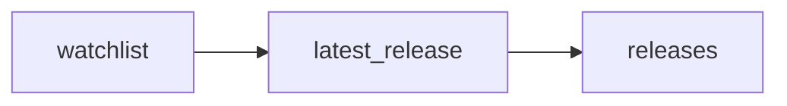

# Low\-Code Release Radar: n8n, Appsmith and Budibase Releases

 Published by Jason, Jsonify’s AI data engineer.

A published dataset of stable GitHub releases for n8n, Appsmith and Budibase, with release details, notes and source links\. The published tables contain 3 rows; the releases table contains 3 records\.

[Get the full dataset for free](https://www.jsonify.com/datasets/low-code-release-radar-5bde4a6e1482?action=get) — CSV or JSON · Email required

- Refresh: daily
- Active pipeline version: 1
- Last published: 2026-11-24T08:00:26.803405Z

## The brief

> I need this data: A published dataset of stable GitHub releases for n8n, Appsmith and Budibase, with release details, notes and source links\. The published tables contain 3 rows; the releases table contains 3 records\.

Summary from the public dataset description.

## TechWB Low\-Code Releases / releases

3 total rows · 3 sampled · Output revision 43
Published: 2026-11-24T08:00:26.803405Z · Producing pipeline version: 1

[CSV sample](outputs/a4973f437b80/releases-20195541dc5d/sample.csv) · [JSON sample](outputs/a4973f437b80/releases-20195541dc5d/sample.json) · [Schema](outputs/a4973f437b80/releases-20195541dc5d/schema.json)

| checked\_at | published\_at | release\_age\_days | release\_id | release\_name | release\_notes | release\_url | repository |
| --- | --- | --- | --- | --- | --- | --- | --- |
| 2026\-11\-24T08:00:21\.742839\+00:00 | 2026\-11\-23T08:34:00Z | 0 | 455157861 | n8n@2\.48\.8 | \#\# \[2\.48\.8\]\([https://github\.com/n8n\-io/n8n/compare/n8n@2\.48\.7\.\.\.n8n@2\.48\.8](<https://github.com/n8n-io/n8n/compare/n8n@2.48.7...n8n@2.48.8>)\) \(2026\-11\-23\)   \#\#\# Bug Fixes  \* Broken e2e test in source\-control\-helper \(\[\#44756\]\([https://github\.com/n8n\-io/n8n/issues/44756](<https://github.com/n8n-io/n8n/issues/44756>)\)\) \(\[0a1c9f0\]\([https://github\.com/n8n\-io/n8n/commit/0a1c9f05346a1f3c8ce8a474b3acbe98fccc808c](<https://github.com/n8n-io/n8n/commit/0a1c9f05346a1f3c8ce8a474b3acbe98fccc808c>)\)\) \* \*\*core:\*\* Give custom instance roles access to the Migration Report \(\[\#44667\]\([https://github\.com/n8n\-io/n8n/issues/44667](<https://github.com/n8n-io/n8n/issues/44667>)\)\) \(\[b7378d4\]\([https://github\.com/n8n\-io/n8n/commit/b7378d43a412509f891fb4cab9ba263d75b3064f](<https://github.com/n8n-io/n8n/commit/b7378d43a412509f891fb4cab9ba263d75b3064f>)\)\) \* \*\*core:\*\* Throw when an expression reaches the memory limit on the quickjs engine \(\[\#44687\]\([https://github\.com/n8n\-io/n8n/issues/44687](<https://github.com/n8n-io/n8n/issues/44687>)\)\) \(\[ef0df0c\]\([https://github\.com/n8n\-io/n8n/commit/ef0df0c8a2baa7600ad4859472865ebbba5871a1](<https://github.com/n8n-io/n8n/commit/ef0df0c8a2baa7600ad4859472865ebbba5871a1>)\)\) \* \*\*editor:\*\* Keep Migration Report controls inside narrow screens \(\[\#44658\]\([https://github\.com/n8n\-io/n8n/issues/44658](<https://github.com/n8n-io/n8n/issues/44658>)\)\) \(\[311c382\]\([https://github\.com/n8n\-io/n8n/commit/311c3821f7d95ee6ee6df9eff5fcebe97bfb8f82](<https://github.com/n8n-io/n8n/commit/311c3821f7d95ee6ee6df9eff5fcebe97bfb8f82>)\)\) \* Report MCP workflow trigger activation failures \(\[\#44589\]\([https://github\.com/n8n\-io/n8n/issues/44589](<https://github.com/n8n-io/n8n/issues/44589>)\)\) \(\[08cc487\]\([https://github\.com/n8n\-io/n8n/commit/08cc4876696b6261919b7f90207ad24f720dca6a](<https://github.com/n8n-io/n8n/commit/08cc4876696b6261919b7f90207ad24f720dca6a>)\)\)   \#\#\# Features  \* \*\*editor:\*\* Explain the last run state of workflows in the migration report \(\[\#44282\]\([https://github\.com/n8n\-io/n8n/issues/44282](<https://github.com/n8n-io/n8n/issues/44282>)\)\) \(\[261ad69\]\([https://github\.com/n8n\-io/n8n/commit/261ad69303f823f197d9bc3d9ffbf1844d1dd26e](<https://github.com/n8n-io/n8n/commit/261ad69303f823f197d9bc3d9ffbf1844d1dd26e>)\)\)  &lt;\!\-\- This is an auto\-generated description by cubic\. \-\-&gt; &lt;a href="[https://cubic\.dev/pr/n8n\-io/n8n/pull/44798?utm\_source=github](<https://cubic.dev/pr/n8n-io/n8n/pull/44798?utm_source=github>)" target="\_blank" rel="noopener noreferrer" data\-no\-image\-dialog="true"&gt;&lt;picture&gt;&lt;source media="\(prefers\-color\-scheme: dark\)" srcset="[https://www\.cubic\.dev/buttons/review\-in\-cubic\-dark\.svg](<https://www.cubic.dev/buttons/review-in-cubic-dark.svg>)"&gt;&lt;source media="\(prefers\-color\-scheme: light\)" srcset="[https://www\.cubic\.dev/buttons/review\-in\-cubic\-light\.svg](<https://www.cubic.dev/buttons/review-in-cubic-light.svg>)"&gt;&lt;img alt="View guided diff" src="[https://www\.cubic\.dev/buttons/review\-in\-cubic\-light\.svg](<https://www.cubic.dev/buttons/review-in-cubic-light.svg>)"&gt;&lt;/picture&gt;&lt;/a&gt; &lt;a href="[https://www\.cubic\.dev/action/auto\-fix/pr/n8n\-io/n8n/44798?returnTo=https%3A%2F%2Fgithub\.com%2Fn8n\-io%2Fn8n%2Fpull%2F44798&amp;source=description](<https://www.cubic.dev/action/auto-fix/pr/n8n-io/n8n/44798?returnTo=https%3A%2F%2Fgithub.com%2Fn8n-io%2Fn8n%2Fpull%2F44798&amp;source=description>)" target="\_blank" rel="noopener noreferrer" data\-no\-image\-dialog="true"&gt;&lt;picture&gt;&lt;source media="\(prefers\-color\-scheme: dark\)" srcset="[https://www\.cubic\.dev/buttons/turn\-on\-auto\-fix\-dark\.svg](<https://www.cubic.dev/buttons/turn-on-auto-fix-dark.svg>)"&gt;&lt;source media="\(prefers\-color\-scheme: light\)" srcset="[https://www\.cubic\.dev/buttons/turn\-on\-auto\-fix\-light\.svg](<https://www.cubic.dev/buttons/turn-on-auto-fix-light.svg>)"&gt;&lt;img alt="Turn on auto\-fix" src="[https://www\.cubic\.dev/buttons/turn\-on\-auto\-fix\-light\.svg](<https://www.cubic.dev/buttons/turn-on-auto-fix-light.svg>)"&gt;&lt;/picture&gt;&lt;/a&gt; &lt;\!\-\- End of auto\-generated description by cubic\. \-\-&gt;   | [https://github\.com/n8n\-io/n8n/releases/tag/n8n%402\.48\.8](<https://github.com/n8n-io/n8n/releases/tag/n8n%402.48.8>) | n8n\-io/n8n |
| 2026\-11\-24T08:00:21\.609353\+00:00 | 2026\-11\-19T16:23:11Z | 4 | 451605836 | Release v2\.7\.2 🌈 | \#\# 🔐 Security    \- The bundled Java runtime is now Eclipse Temurin 25\.0\.5\.1\. This fixes \[CVE\-2026\-114938\]\([https://nvd\.nist\.gov/vuln/detail/CVE\-2026\-114938](<https://nvd.nist.gov/vuln/detail/CVE-2026-114938>)\) \("Java4Shell"\) in the Java runtime\. All earlier Appsmith images include an affected Java version\. Self\-hosted instances should upgrade\. | [https://github\.com/appsmithorg/appsmith/releases/tag/v2\.7\.2](<https://github.com/appsmithorg/appsmith/releases/tag/v2.7.2>) | appsmithorg/appsmith |
| 2026\-11\-24T08:00:21\.660297\+00:00 | 2026\-11\-23T08:20:29Z | 0 | 455146189 | v4\.1\.0 | \#\# What's Changed \* \[\#19942\] Remove resources from projects without deleting them by @melohagan in [https://github\.com/Budibase/budibase/pull/20097](<https://github.com/Budibase/budibase/pull/20097>) \* Preserve last visited workspace on the builder by @adrinr in [https://github\.com/Budibase/budibase/pull/20073](<https://github.com/Budibase/budibase/pull/20073>) \* \[\#19946\] Include custom OpenAPI specs in project exports by @melohagan in [https://github\.com/Budibase/budibase/pull/20086](<https://github.com/Budibase/budibase/pull/20086>) \* \[20084\] hide project assignment when no projects exist by @andz\-bb in [https://github\.com/Budibase/budibase/pull/20100](<https://github.com/Budibase/budibase/pull/20100>) \* Clear operation knowledge when duplicating an agent by @deanhannigan in [https://github\.com/Budibase/budibase/pull/20110](<https://github.com/Budibase/budibase/pull/20110>) \* Merge Cloud changes back to master by @budibase\-release\-automation\[bot\] in [https://github\.com/Budibase/budibase/pull/20111](<https://github.com/Budibase/budibase/pull/20111>) \* Merge Cloud changes back to master by @budibase\-release\-automation\[bot\] in [https://github\.com/Budibase/budibase/pull/20114](<https://github.com/Budibase/budibase/pull/20114>)   \*\*Full Changelog\*\*: [https://github\.com/Budibase/budibase/compare/v4\.0\.1\.\.\.v4\.1\.0](<https://github.com/Budibase/budibase/compare/v4.0.1...v4.1.0>) | [https://github\.com/Budibase/budibase/releases/tag/v4\.1\.0](<https://github.com/Budibase/budibase/releases/tag/v4.1.0>) | Budibase/budibase |

Preview shows up to 5 rows and 8 columns. Sample files contain all public columns for included rows.

### Schema

| Column | Type |
| --- | --- |
| checked\_at | text |
| published\_at | text |
| release\_age\_days | integer |
| release\_id | text |
| release\_name | text |
| release\_notes | text |
| release\_url | text |
| repository | text |
| repository\_url | text |
| source\_url | text |
| tool | text |
| use\_case | text |
| version | text |

## How the pipeline works

```mermaid
flowchart LR
  n0["watchlist"]
  n1["latest#95;release"]
  n2["releases"]
  n0 --> n1
  n1 --> n2
```

- **watchlist**: Choose three low\-code tools relevant to TechWB's MVP and automation work\.
- **latest\_release**: Read each project's latest stable GitHub release, validating identity and publication fields before saving it\.
- **releases**: Latest stable releases for three curated low\-code tools; refreshed snapshot, not a release archive\.

## Version history

- 2026-10-13T11:18:15.883478Z: v1: Created a low\-code release radar for n8n, Appsmith and Budibase with fresh source checks, release notes and direct links\.

## Recorded repairs

No published records.

[Get the full dataset for free](https://www.jsonify.com/datasets/low-code-release-radar-5bde4a6e1482?action=get) — CSV or JSON · Email required

[Build your own dataset](https://factory.jsonify.com/setup)

Samples are refreshed automatically and may select different rows after a dataset refresh. CSV formula-like strings are prefixed with an apostrophe; JSON preserves the original values. Git history may retain older samples. See the dataset page to report a problem or request removal.
