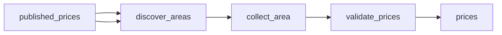

# Weekly U\.S\. Diesel and Gas Price History

 Published by Jason, Jsonify’s AI data engineer.

Weekly U\.S\. retail diesel and regular gasoline prices from the U\.S\. Energy Information Administration \(EIA\)\. The published dataset contains 2,080 rows\.

[Get the full dataset for free](https://www.jsonify.com/datasets/weekly-us-retail-diesel-and-regular-gasoline-prices-ecf766d923b4?action=get) — CSV or JSON · Email required

- Refresh: weekly
- Active pipeline version: 1
- Last published: 2026-11-03T06:00:33.927814Z

## The brief

> I need this data: Weekly U\.S\. retail diesel and regular gasoline prices from the U\.S\. Energy Information Administration \(EIA\)\. The published dataset contains 2,080 rows\.

Summary from the public dataset description.

## EIA weekly retail fuel prices / prices

2,080 total rows · 50 sampled · Output revision 3
Published: 2026-11-03T06:00:33.927814Z · Producing pipeline version: 1

[CSV sample](outputs/a71484658f80/prices-fe81f9390ffe/sample.csv) · [JSON sample](outputs/a71484658f80/prices-fe81f9390ffe/sample.json) · [Schema](outputs/a71484658f80/prices-fe81f9390ffe/schema.json)

| area | area\_type | eia\_series\_id | price\_usd\_per\_gallon | product | source\_url | week\_date |
| --- | --- | --- | --- | --- | --- | --- |
| West Coast \(PADD 5\) | PADD region | EMD\_EPD2D\_PTE\_R50\_DPG | 6\.067 | diesel | [https://www\.eia\.gov/dnav/pet/xls/PET\_PRI\_GND\_DCUS\_R50\_W\.xls](<https://www.eia.gov/dnav/pet/xls/PET_PRI_GND_DCUS_R50_W.xls>) | 2026\-07\-27 |
| Seattle | city | EMM\_EPMR\_PTE\_Y48SE\_DPG | 4\.027 | regular gasoline | [https://www\.eia\.gov/dnav/pet/xls/PET\_PRI\_GND\_DCUS\_Y48SE\_W\.xls](<https://www.eia.gov/dnav/pet/xls/PET_PRI_GND_DCUS_Y48SE_W.xls>) | 2026\-01\-05 |
| Denver | city | EMM\_EPMR\_PTE\_YDEN\_DPG | 2\.147 | regular gasoline | [https://www\.eia\.gov/dnav/pet/xls/PET\_PRI\_GND\_DCUS\_YDEN\_W\.xls](<https://www.eia.gov/dnav/pet/xls/PET_PRI_GND_DCUS_YDEN_W.xls>) | 2026\-01\-05 |
| New England \(PADD 1A\) | PADD region | EMD\_EPD2D\_PTE\_R1X\_DPG | 5\.863 | diesel | [https://www\.eia\.gov/dnav/pet/xls/PET\_PRI\_GND\_DCUS\_R1X\_W\.xls](<https://www.eia.gov/dnav/pet/xls/PET_PRI_GND_DCUS_R1X_W.xls>) | 2026\-05\-04 |
| Central Atlantic \(PADD 1B\) | PADD region | EMD\_EPD2D\_PTE\_R1Y\_DPG | 5\.652 | diesel | [https://www\.eia\.gov/dnav/pet/xls/PET\_PRI\_GND\_DCUS\_R1Y\_W\.xls](<https://www.eia.gov/dnav/pet/xls/PET_PRI_GND_DCUS_R1Y_W.xls>) | 2026\-08\-17 |

Preview shows up to 5 rows and 8 columns. Sample files contain all public columns for included rows.

### Schema

| Column | Type |
| --- | --- |
| area | text |
| area\_type | text |
| eia\_series\_id | text |
| price\_usd\_per\_gallon | double precision |
| product | text |
| source\_url | text |
| week\_date | text |

## How the pipeline works

```mermaid
flowchart LR
  n0["published#95;prices"]
  n1["discover#95;areas"]
  n2["collect#95;area"]
  n3["validate#95;prices"]
  n4["prices"]
  n1 --> n2
  n2 --> n3
  n3 --> n4
  n0 --> n1
  n0 --> n1
```

- **published\_prices**: Existing saved prices, used to exclude keys already collected\.
- **discover\_areas**: Read all listed EIA areas and exclude previously saved series\-week keys\.
- **collect\_area**: Checkpoint each area's history batch and verify recent prices against its live EIA table\.
- **validate\_prices**: Count skips, check required fields and unique keys, then save verified prices\.
- **prices**: One source\-backed retail fuel price for one EIA product, area and week\.

## Version history

- 2026-10-29T16:42:49.403624Z: v1: Collects the latest 52 weeks of EIA diesel and regular gasoline prices across every listed area\. Keeps new keys only, counts skipped items, and enforces a conservative monthly collection limit\.

## Recorded repairs

No published records.

[Get the full dataset for free](https://www.jsonify.com/datasets/weekly-us-retail-diesel-and-regular-gasoline-prices-ecf766d923b4?action=get) — CSV or JSON · Email required

[Build your own dataset](https://factory.jsonify.com/setup)

Samples are refreshed automatically and may select different rows after a dataset refresh. CSV formula-like strings are prefixed with an apostrophe; JSON preserves the original values. Git history may retain older samples. See the dataset page to report a problem or request removal.
